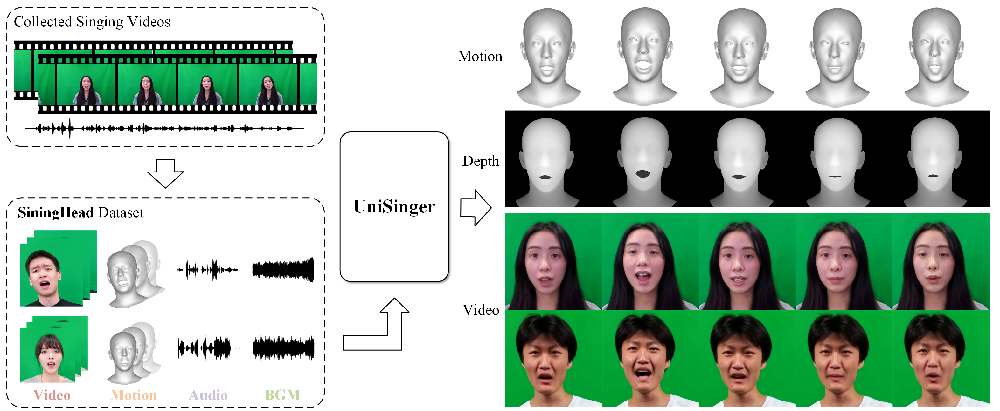

# SingingHead: A Large-scale 4D Dataset for Singing Head Animation
## [arXiv](https://arxiv.org/pdf/2312.04369.pdf) | [Project Page](https://wsj-sjtu.github.io/SingingHead/)

 

## TODO
- [ ] Release the codes for calculating the metrics of two benchmarks.
- [ ] Release the scripts for visualizing the 3D facial motion.
- [x] Release the SingingHead dataset.

## SingingHead Dataset
### Download

### Overview
The SingingHead dataset is a large-scale 4D dataset for singing head animation. It contains more than 27 hours of synchronized singing video, 3D facial motion, singing
audio, and background music collected from 76 subjects. 
The video is captured in 30fps and cropped into a resolution of 1024×1024.
The 3D facial motion is represented by 59-dimensional [FLAME](https://flame.is.tue.mpg.de/) parameters (50 expression + 3 neck pose + 3 jaw pose).
All the data sequences are cut into equal-length 8s segments, resulting in a total of 12196 sequences.

### Data Structure
```
SingingHead
├── train.txt
├── val.txt
├── test.txt
├── video_seqs.zip
│   ├── id0_10_0_0.mp4
│   └── ...
├── flame_seqs.zip
│   ├── id0_10_0_0.pkl
│   └── ...
├── audio_seqs.zip
│   ├── id0_10_0_0.wav
│   └── ...
└── bgm_seqs.zip
    ├── id0_10_0_0_bgm.wav
    └── ...
```

## Citation
If you use this dataset, please consider citing
```
@article{wu2023singinghead,
  title={SingingHead: A Large-scale 4D Dataset for Singing Head Animation},
  author={Wu, Sijing and Li, Yunhao and Zhang, Weitian and Jia, Jun and Zhu, Yucheng and Yan, Yichao and Zhai, Guangtao},
  journal={arXiv preprint arXiv:2312.04369},
  year={2023}
}
```

## Contact
- Sijing Wu [(wusijing@sjtu.edu.cn)](wusijing@sjtu.edu.cn)
